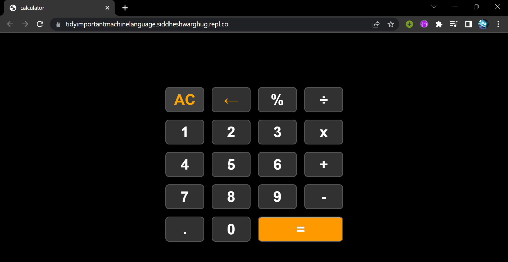

# Calculator

This is a simple calculator created using HTML, CSS, and JavaScript. It allows users to perform basic arithmetic operations such as addition, subtraction, multiplication, division, and modulo.

## Features

- Addition
- Subtraction
- Multiplication
- Division
- Modulo
- Clearing the current input
- Deleting the last entered digit
- Responsive design

##Screenshot

